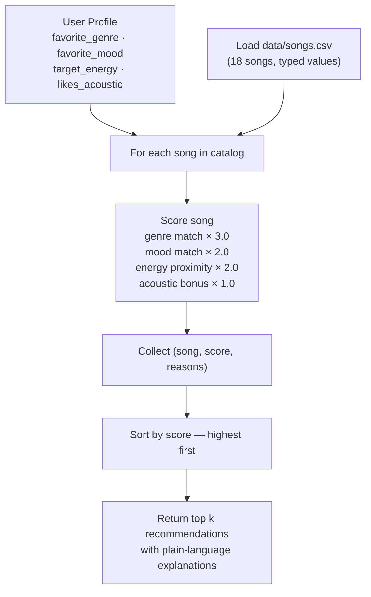

# 🎵 Music Recommender Simulation

## Project Summary

In this project you will build and explain a small music recommender system.

Your goal is to:

- Represent songs and a user "taste profile" as data
- Design a scoring rule that turns that data into recommendations
- Evaluate what your system gets right and wrong
- Reflect on how this mirrors real world AI recommenders

This version builds a **content-based recommender** that scores each song against a user's taste profile using weighted attributes — genre, mood, energy, and acoustic preference. It ranks the full catalog by score and returns the top matches, with a plain-language explanation of why each song was chosen.

---

## How The System Works

Real-world streaming platforms like Spotify and YouTube use two main approaches to predict what you'll love. **Collaborative filtering** looks across millions of users to find people with similar listening histories — "users like you also played this." **Content-based filtering** skips the crowd and instead matches song attributes directly to your stated preferences — tempo, genre, mood, energy level. Our simulator uses the content-based approach because it works without needing any other users' data and makes its reasoning transparent and easy to inspect.

### Features each `Song` uses

| Feature | Type | Role in scoring |
|---|---|---|
| `genre` | text | Primary taste signal — strongest weight |
| `mood` | text | Captures the "vibe" independent of genre |
| `energy` | 0.0–1.0 | Proximity match to the user's preferred energy |
| `acousticness` | 0.0–1.0 | Signals whether a song is instrumental/chill or produced |
| `valence` | 0.0–1.0 | Emotional brightness (happy vs. melancholy) — used for tiebreaking |

`tempo_bpm` and `danceability` are available in the dataset but are not primary scoring features, since they correlate strongly with energy and genre and would add redundant weight.

### What `UserProfile` stores

- `favorite_genre` — the genre the user most wants to hear (e.g., `"lofi"`)
- `favorite_mood` — the mood they are seeking (e.g., `"chill"`)
- `target_energy` — a 0–1 float representing how energetic they want the music (e.g., `0.4`)
- `likes_acoustic` — a boolean for whether they prefer acoustic/organic sounds over produced ones

### How `Recommender` computes a score

Each song receives a total score built from weighted components:

```
score = genre_match × 3.0
      + mood_match × 2.0
      + (1 - |target_energy - song.energy|) × 2.0
      + acoustic_bonus × 1.0
```

- `genre_match` and `mood_match` are 1 if the song matches the user's preference, 0 otherwise
- The energy term rewards songs *close* to the user's preferred level — a perfect match scores 2.0, a total mismatch scores 0.0
- `acoustic_bonus` is 1.0 if the user `likes_acoustic` and the song's `acousticness > 0.5`

Max possible score: **8.0**

### How songs are chosen

After every song is scored, the full list is sorted highest-to-lowest and the top `k` results are returned (default `k = 5`). This is the **ranking rule** — separate from the scoring rule. The scoring rule answers "how relevant is this one song?"; the ranking rule answers "which songs win when we compare them all?"

### Data flow diagram



### Potential biases to watch for

- **Genre lock-in** — genre carries the highest weight (3.0), so a song with a perfect energy and mood match but a different genre will almost always lose to a genre-match with poor energy. A user who listed `"pop"` will never discover great blues or jazz tracks unless they change their profile.
- **Filter bubble effect** — because all scoring is driven by what the user already declared, the system reinforces existing taste and never introduces serendipitous variety.
- **Acoustic bias** — the acoustic bonus only applies when `likes_acoustic=True`; users who prefer produced/electronic sounds receive no equivalent bonus, so the system is slightly asymmetric.
- **Catalog coverage** — with only 18 songs, certain moods (e.g., `"hype"`, `"euphoric"`) have just one representative track, meaning a matching user always gets the same top result regardless of other attributes.

---

## Getting Started

### Setup

1. Create a virtual environment (optional but recommended):

   ```bash
   python -m venv .venv
   source .venv/bin/activate      # Mac or Linux
   .venv\Scripts\activate         # Windows

2. Install dependencies

```bash
pip install -r requirements.txt
```

3. Run the app:

```bash
python -m src.main
```

### Running Tests

Run the starter tests with:

```bash
pytest
```

You can add more tests in `tests/test_recommender.py`.

---

## Experiments You Tried

### Six test profiles

Six user profiles were run against the 18-song catalog:

| Profile | Top result | Notes |
|---|---|---|
| High-Energy Pop Fan (pop/happy/0.8) | Sunrise City (score 6.96) | Near-perfect match — genre, mood, and energy all align |
| Chill Lofi Student (lofi/chill/0.38, acoustic) | Library Rain (score 7.94) | Acoustic bonus pushed it just ahead of Midnight Coding |
| Intense Rock Fan (rock/intense/0.92) | Storm Runner (score 6.98) | Only one rock song, but it fits perfectly |
| Smooth R&B Listener (r&b/smooth/0.55) | Slow Burn (score 7.00) | Perfect match; #2–5 are generic energy-only picks |
| Acoustic Folk Dreamer (folk/dreamy/0.30, acoustic) | Wildflower Road (score 8.00) | Maximum possible score — all four components matched |
| Edge Case: Classical/Peaceful but energy=0.9 | Morning Sonata (score 6.64) | Bug-like behavior: genre+mood won even with a 0.68 energy gap |

### Weight-shift experiment

Genre weight halved (3.0 → 1.5), energy weight doubled (2.0 → 4.0):

- **Pop/happy user:** Rooftop Lights jumped from #3 to #2 — mood match + energy proximity now outweighs being the wrong genre.
- **Edge case user:** Morning Sonata's score dropped from 6.64 to 5.78. Storm Runner (energy 0.91, matching the target) rose to #2, confirming the system can detect better energy matches when genre is less dominant.
- **Conclusion:** Higher energy weight makes recommendations more "vibe-sensitive" and less genre-locked. It also exposes the edge case problem more clearly — the system should probably not confidently recommend Morning Sonata to a user who wants high-energy music, regardless of genre match.

---

## Limitations and Risks

- **Tiny catalog** — 18 songs means genres with only one entry always return the same top result. Variety is impossible at this scale.
- **Genre lock-in** — The 3-point genre weight dominates scoring. A song in the wrong genre almost never beats a genre-match, even if everything else fits better.
- **Binary matching** — Genre and mood are full match or nothing. "Indie pop" gets zero credit toward a "pop" user, and "relaxed" gets zero credit toward a "chill" user.
- **Conflicting preferences break the system** — The edge case (classical/peaceful, energy=0.9) surfaces a real flaw: genre+mood match wins regardless of how badly the energy conflicts.
- **No learning or history** — The system treats every session identically. It cannot remember what the user has already heard or improve over time.

See `model_card.md` for a deeper analysis of each limitation.

---

## Reflection

Read and complete `model_card.md`:

[**Model Card**](model_card.md)

Building this recommender showed me how straightforward it actually is to turn user preferences into ranked predictions, you just assign weights to features, score every song, and sort. What stood out was how predictable and transparent the results were: once you know the weights, you can mentally trace exactly why a song ranked where it did. That transparency is something real apps like Spotify don't give you, even though their underlying logic is doing something similar at a much larger scale.

The biggest bias risk I noticed is that the system creates a genre filter bubble by design. Because genre carries the most weight, a user who picks "pop" will only ever see pop songs near the top, no matter how well other songs might match their energy or mood. If this were a real product, users would never discover music outside their stated preference, the system would just keep reinforcing what they already said they liked. That's exactly how real recommenders can quietly limit what people get exposed to over time, even when the algorithm is technically doing its job correctly.


---

## 7. `model_card_template.md`

Combines reflection and model card framing from the Module 3 guidance. :contentReference[oaicite:2]{index=2}  

```markdown
# 🎧 Model Card - Music Recommender Simulation

## 1. Model Name

Give your recommender a name, for example:

> VibeFinder 1.0

---

## 2. Intended Use

- What is this system trying to do
- Who is it for

Example:

> This model suggests 3 to 5 songs from a small catalog based on a user's preferred genre, mood, and energy level. It is for classroom exploration only, not for real users.

---

## 3. How It Works (Short Explanation)

Describe your scoring logic in plain language.

- What features of each song does it consider
- What information about the user does it use
- How does it turn those into a number

Try to avoid code in this section, treat it like an explanation to a non programmer.

---

## 4. Data

Describe your dataset.

- How many songs are in `data/songs.csv`
- Did you add or remove any songs
- What kinds of genres or moods are represented
- Whose taste does this data mostly reflect

---

## 5. Strengths

Where does your recommender work well

You can think about:
- Situations where the top results "felt right"
- Particular user profiles it served well
- Simplicity or transparency benefits

---

## 6. Limitations and Bias

Where does your recommender struggle

Some prompts:
- Does it ignore some genres or moods
- Does it treat all users as if they have the same taste shape
- Is it biased toward high energy or one genre by default
- How could this be unfair if used in a real product

---

## 7. Evaluation

How did you check your system

Examples:
- You tried multiple user profiles and wrote down whether the results matched your expectations
- You compared your simulation to what a real app like Spotify or YouTube tends to recommend
- You wrote tests for your scoring logic

You do not need a numeric metric, but if you used one, explain what it measures.

---

## 8. Future Work

If you had more time, how would you improve this recommender

Examples:

- Add support for multiple users and "group vibe" recommendations
- Balance diversity of songs instead of always picking the closest match
- Use more features, like tempo ranges or lyric themes

---

## 9. Personal Reflection

A few sentences about what you learned:

- What surprised you about how your system behaved

- How did building this change how you think about real music recommenders
- Where do you think human judgment still matters, even if the model seems "smart"

